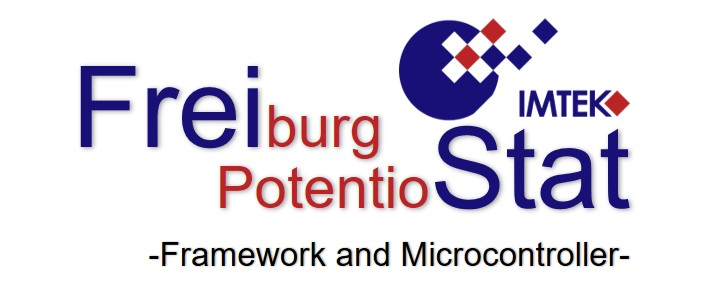
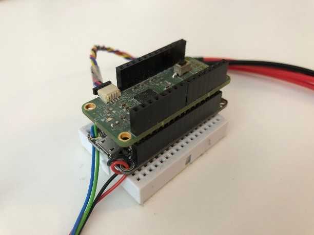

# FreiStat - Potentiostat
Contributors: 
- Mark Jasper
- David Bill 

Supervision:
- Jochen Kieninger

Contacts: 
- Mark Jasper, mark.jasper@imtek.uni-freiburg.de
- Dr. Jochen Kieninger, kieninger@imtek.uni-freiburg.de

[Laboratory for Sensors](https://www.imtek.de/laboratories/sensors/sensors_home?set_language=en), IMTEK, University of Freiburg

## About FreiStat
The FreiStat is an open-source small scale potentiostat on the basis of the 
AD5941 potentiostat chip of Analog Devices Inc. and an Adafruit Feather M0. 

The FreiStat supports communication over serial USB, WiFi or as a standalone
microcontroller software.

## About
This repository contains the Python framework and the corresponding software for
the microcontroller in C++ to run the FreiStat for different electrochemical
methods. 
Informations about the function scope, as well as help can be found in the 
[wiki](https://github.com/IMTEK-FreiStat/FreiStat-Framework/wiki).

## Acknowledgement
The code is loosely based on the ideas of the example code of the AD5941 
[example repository](https://github.com/analogdevicesinc/ad5940-examples), of 
Analog Devices Inc.
